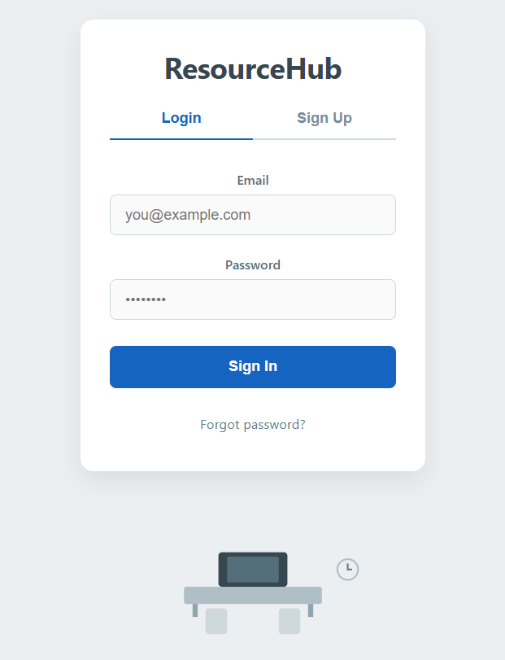
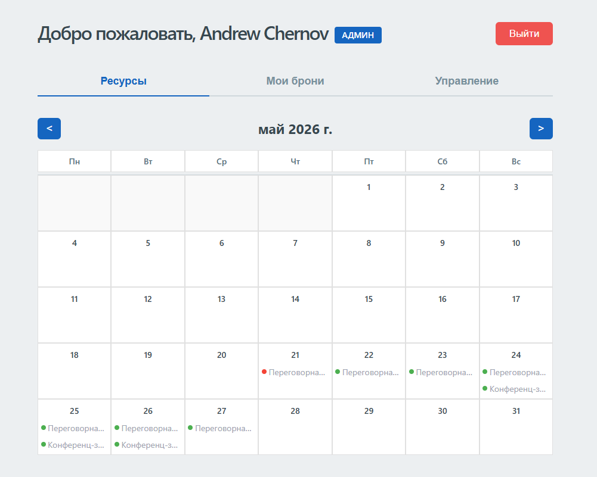
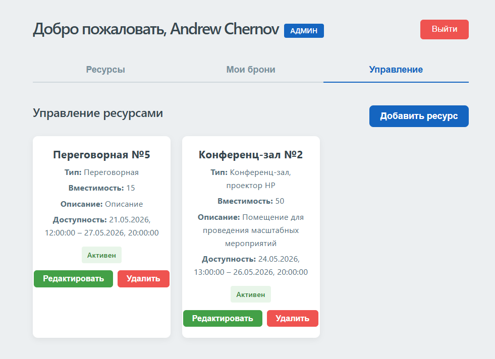
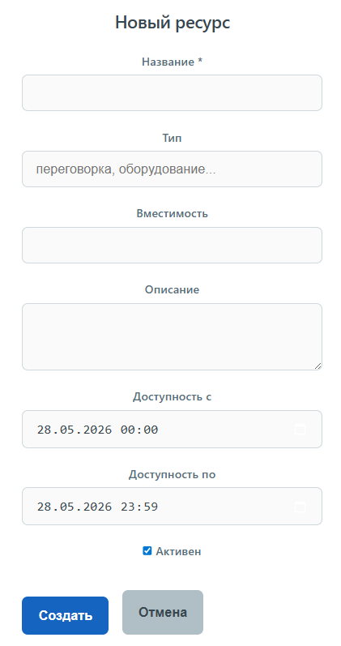

# 📅 ResourceHub

**Система бронирования переговорных комнат и оборудования**  
Полнофункциональное веб-приложение с календарём доступности, ролевой моделью и защитой от конфликтов бронирования.






---

## ✨ Основные возможности

- 🗓️ **Календарь ресурсов** с помесячной навигацией и цветовой индикацией занятости (свободен/частично занят/занят/истёк/неактивен)
- 🔐 **Ролевая модель** – обычный пользователь и администратор
- ➕ **Управление ресурсами** – создание, редактирование, удаление с указанием периода доступности и времени работы
- 📋 **Бронирование** – выбор даты и времени в пределах доступности ресурса
- ❌ **Отмена бронирования** с автоматическим обновлением календаря
- 🛡️ **Защита от двойного бронирования** (double booking) на уровне базы данных и сервера

---

## 🧱 Технологический стек

| Слой | Технологии |
|------|-----------|
| **Frontend** | React 18, Vite, React Router v6, CSS |
| **Backend**  | Node.js, Express, jsonwebtoken, bcrypt |
| **Database** | PostgreSQL, pg (node-postgres), btree_gist |
| **Tools**    | Git, GitHub, pgAdmin, VS Code |

---

## 🏗️ Архитектура

Приложение построено на классической клиент‑серверной архитектуре.

- **Клиент** (React) – одностраничное приложение, общающееся с сервером по REST API
- **Сервер** (Express) – обрабатывает запросы, взаимодействует с PostgreSQL, управляет аутентификацией и авторизацией через JWT
- **База данных** (PostgreSQL) – хранит пользователей, ресурсы и бронирования, обеспечивает целостность данных

[Browser] ←→ [React + Vite] ←→ [Express API] ←→ [PostgreSQL]

---

## 🛡️ Защита от конфликтов (double booking)

- На уровне базы данных используется **частичный уникальный индекс** с `btree_gist`:

```sql
CREATE UNIQUE INDEX bookings_active_no_overlap
ON bookings (resource_id, tstzrange(start_time, end_time))
WHERE status = 'active';
